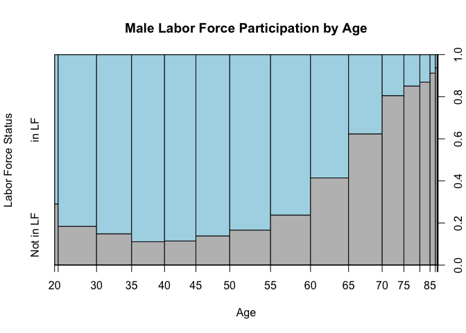

Lab6
================
Author: Isabela Vieira
Collaborators: Christopher Tinevra, Akimawe Kadiri, Nicole Kerrison,Mostafa Ragheb, Charles Reed, Monica Martinez-Raga
11/6/2020

``` r
load("~/Documents/College/Fall 2020/Econometrics/acs2017_ny_data.RData")
attach(acs2017_ny)
```

Create a variable that will allow us to restrict the dataset to only
work with a choosen population. I’m interested in seing the labor
patterns within the female population, mainly because there are
insteresting factors that might affect women’s participation in the
labor force that generally would not affect men (accoding to my personal
bias, we’ll see if that bias holds). For instance, number of children
and marital status. In the lab we saw that NAs only appeared when age
\<25, so we’ll restrict our dataset so to include only females aged 25+.
This population of females aged 25+ has a total number of observations
equal to 74,007.

``` r
use_varb <- (AGE >= 25) & (female == 1) 
dat_use <- subset(acs2017_ny,use_varb) 
detach()
attach(dat_use)
```

Fixing the data so that we have labels for our factors:

``` r
dat_use$LABFORCE <- as.factor(dat_use$LABFORCE)
levels(dat_use$LABFORCE) <- c("Not in LF","in LF", "N/A")

dat_use$MARST <- as.factor(dat_use$MARST)
levels(dat_use$MARST) <- c("married spouse present","married spouse absent","separated","divorced","widowed","never married")
```

Let’s see how does the labor force participation by age group looks
like:

``` r
library(kableExtra)
```

    ## Warning: package 'kableExtra' was built under R version 3.6.2

``` r
dat_use$age_bands <- cut(dat_use$AGE,breaks=c(25,35,45,55,65,100)) #This is an interesting piece of code that allows "divide" a certain variable into breaks. That way we can understand labor participation by group of age. 

lf <- table(dat_use$age_bands,dat_use$LABFORCE) #Creates a variable containing a table of participation in the labor force by age group.


#The below piece of code creates a nice-looking table out of lf variable we created:
lf %>% 
  kbl() %>%
  kable_styling()
```

<table class="table" style="margin-left: auto; margin-right: auto;">

<thead>

<tr>

<th style="text-align:left;">

</th>

<th style="text-align:right;">

Not in LF

</th>

<th style="text-align:right;">

in
LF

</th>

<th style="text-align:right;">

N/A

</th>

</tr>

</thead>

<tbody>

<tr>

<td style="text-align:left;">

(25,35\]

</td>

<td style="text-align:right;">

2456

</td>

<td style="text-align:right;">

10070

</td>

<td style="text-align:right;">

0

</td>

</tr>

<tr>

<td style="text-align:left;">

(35,45\]

</td>

<td style="text-align:right;">

2699

</td>

<td style="text-align:right;">

9168

</td>

<td style="text-align:right;">

0

</td>

</tr>

<tr>

<td style="text-align:left;">

(45,55\]

</td>

<td style="text-align:right;">

3245

</td>

<td style="text-align:right;">

10739

</td>

<td style="text-align:right;">

0

</td>

</tr>

<tr>

<td style="text-align:left;">

(55,65\]

</td>

<td style="text-align:right;">

6047

</td>

<td style="text-align:right;">

8980

</td>

<td style="text-align:right;">

0

</td>

</tr>

<tr>

<td style="text-align:left;">

(65,100\]

</td>

<td style="text-align:right;">

16751

</td>

<td style="text-align:right;">

2629

</td>

<td style="text-align:right;">

0

</td>

</tr>

</tbody>

</table>

``` r
#Here is a graph for visually showing participation in the labor force by age group:
plot(lf, main="Labor Force Participation by Age Group",
xlab="Age Group",
ylab="Participation", 
col = c("grey", "pink"))
```

<!-- -->

Since we excluded anyone younger than 25 we don’t have to deal with the
NAs in our data. In the class lab we saw that some NAs showed for people
below 25, probabily because some people go through college without
working or actively looking for work. In the table above we see that the
female population above 65 has a lower participation rate than other age
groups. I wish I could show this in the table, but I tried several
things and nothing worked with an object of class table. Nevertheless,
the graph visually shows that participation rate tends to decrease in
the age groups 55-100.

Now, let’s create a logistic regression for that

``` r
model_logit1 <- glm(LABFORCE ~ AGE + MARST + NCHILD,
            family = binomial, data = dat_use)

summary(model_logit1)
```

    ## 
    ## Call:
    ## glm(formula = LABFORCE ~ AGE + MARST + NCHILD, family = binomial, 
    ##     data = dat_use)
    ## 
    ## Deviance Residuals: 
    ##     Min       1Q   Median       3Q      Max  
    ## -2.5017  -0.8712   0.4608   0.8790   2.5451  
    ## 
    ## Coefficients:
    ##                              Estimate Std. Error  z value Pr(>|z|)    
    ## (Intercept)                 4.6818495  0.0466320  100.400  < 2e-16 ***
    ## AGE                        -0.0768293  0.0007435 -103.337  < 2e-16 ***
    ## MARSTmarried spouse absent -0.4182760  0.0540144   -7.744 9.65e-15 ***
    ## MARSTseparated              0.0369171  0.0523953    0.705    0.481    
    ## MARSTdivorced               0.3234152  0.0268916   12.027  < 2e-16 ***
    ## MARSTwidowed               -0.5818991  0.0348689  -16.688  < 2e-16 ***
    ## MARSTnever married         -0.2466331  0.0250726   -9.837  < 2e-16 ***
    ## NCHILD                     -0.1256825  0.0089298  -14.075  < 2e-16 ***
    ## ---
    ## Signif. codes:  0 '***' 0.001 '**' 0.01 '*' 0.05 '.' 0.1 ' ' 1
    ## 
    ## (Dispersion parameter for binomial family taken to be 1)
    ## 
    ##     Null deviance: 100920  on 74006  degrees of freedom
    ## Residual deviance:  78955  on 73999  degrees of freedom
    ## AIC: 78971
    ## 
    ## Number of Fisher Scoring iterations: 4

``` r
library(stargazer)
```

    ## 
    ## Please cite as:

    ##  Hlavac, Marek (2018). stargazer: Well-Formatted Regression and Summary Statistics Tables.

    ##  R package version 5.2.2. https://CRAN.R-project.org/package=stargazer

``` r
stargazer(model_logit1, type="text") #Let's make it prettier and easier to interpret. 
```

    ## 
    ## ======================================================
    ##                                Dependent variable:    
    ##                            ---------------------------
    ##                                     LABFORCE          
    ## ------------------------------------------------------
    ## AGE                                 -0.077***         
    ##                                      (0.001)          
    ##                                                       
    ## MARSTmarried spouse absent          -0.418***         
    ##                                      (0.054)          
    ##                                                       
    ## MARSTseparated                        0.037           
    ##                                      (0.052)          
    ##                                                       
    ## MARSTdivorced                       0.323***          
    ##                                      (0.027)          
    ##                                                       
    ## MARSTwidowed                        -0.582***         
    ##                                      (0.035)          
    ##                                                       
    ## MARSTnever married                  -0.247***         
    ##                                      (0.025)          
    ##                                                       
    ## NCHILD                              -0.126***         
    ##                                      (0.009)          
    ##                                                       
    ## Constant                            4.682***          
    ##                                      (0.047)          
    ##                                                       
    ## ------------------------------------------------------
    ## Observations                         74,007           
    ## Log Likelihood                     -39,477.480        
    ## Akaike Inf. Crit.                  78,970.960         
    ## ======================================================
    ## Note:                      *p<0.1; **p<0.05; ***p<0.01

We see that all variables but “separated” are statistically significant
(\*\*\*), meaning that there is a great chance that this model isn’t
random and there is an actual relationship between the labor force
status, marital status, and number of children amongst the female
population between 25 and 55.

Now, let’s graph it:

``` r
dat_use$LABFORCE <- droplevels(dat_use$LABFORCE)

NNobs <- length(dat_use$LABFORCE)
set.seed(12345) # just so you can replicate and get same "random" choices
graph_obs <- (runif(NNobs) < 0.1) # so something like just 1/10 as many obs
dat_graph <-subset(dat_use,graph_obs)  

 plot(LABFORCE ~ jitter(AGE, factor = 2), pch = 16, ylim = c(0,1), data = dat_graph, main = "Labor Force Participation by Age", xlab = "Age", ylab = "Labor Force Status", col = c("grey","pink"))


to_be_predicted <- data.frame(AGE = 25:55, MARST = "never married", NCHILD = 1)
to_be_predicted$yhat <- predict(model_logit1, newdata = to_be_predicted)

lines(yhat ~ AGE, data = to_be_predicted)
```

<!-- -->

Odds Ratio - This will help us to see how much an increase in a given
variable will *cause* a increase/decrease in our dependent (y) variable,
in this case the labor force status. This will get a little tricky,
because we are using MARST which is a categorical data (it’s not
ordered). What I could do is create a new model in which I use the
variable unmarried, which is binomial.

``` r
#Transform "unmarried" variable into a factor:
dat_use$unmarried <- as.factor(dat_use$unmarried)
levels(dat_use$unmarried) <- c("Married","Unmarried")


model_logit2 <- glm(LABFORCE ~ AGE + unmarried + NCHILD,
            family = binomial, data = dat_use)

stargazer(model_logit2, type="text") #Let's make it prettier and easier to interpret. 
```

    ## 
    ## ==============================================
    ##                        Dependent variable:    
    ##                    ---------------------------
    ##                             LABFORCE          
    ## ----------------------------------------------
    ## AGE                         -0.080***         
    ##                              (0.001)          
    ##                                               
    ## unmarriedUnmarried          -0.264***         
    ##                              (0.024)          
    ##                                               
    ## NCHILD                      -0.134***         
    ##                              (0.009)          
    ##                                               
    ## Constant                    4.861***          
    ##                              (0.046)          
    ##                                               
    ## ----------------------------------------------
    ## Observations                 74,007           
    ## Log Likelihood             -39,778.120        
    ## Akaike Inf. Crit.          79,564.240         
    ## ==============================================
    ## Note:              *p<0.1; **p<0.05; ***p<0.01

The above means that the numeric variables for age and number of
children have a negative correlation with the labor force status
(Remember that \*\*\* means this falls into a confidence interval of 99%
and is statistically significant). So, for instance, the greater the
NCHILD value, the more likely is that the LABFORCE will be “lower”, in
this case equal to 0, or not in the labor force.

Now, we’ll look into elasticity (% change in dependent variable Y given
a change in X variables) by using the odds ratio.

I found this interesting thing in interpreting odds ratio: “Relative
risk ratios allow an easier interpretation of the logit coefficients.
They are the exponentiated value of the logit coefficients.”

``` r
#To exponentiate the value of the logit coefs:
logit.or = exp(coef(model_logit2))
stargazer(model_logit2, type="text", coef=list(logit.or), p.auto=FALSE)
```

    ## 
    ## ==============================================
    ##                        Dependent variable:    
    ##                    ---------------------------
    ##                             LABFORCE          
    ## ----------------------------------------------
    ## AGE                         0.923***          
    ##                              (0.001)          
    ##                                               
    ## unmarriedUnmarried          0.768***          
    ##                              (0.024)          
    ##                                               
    ## NCHILD                      0.875***          
    ##                              (0.009)          
    ##                                               
    ## Constant                   129.164***         
    ##                              (0.046)          
    ##                                               
    ## ----------------------------------------------
    ## Observations                 74,007           
    ## Log Likelihood             -39,778.120        
    ## Akaike Inf. Crit.          79,564.240         
    ## ==============================================
    ## Note:              *p<0.1; **p<0.05; ***p<0.01

Keeping all other variables constant, when the number of children
increases one unit, it is 0.875 (or 87.5%) times more likely that woman
will not be in the labor force. As we see above, this results are
statistically significant.

The tricky part in here is that 1 unit of age is nothing in the
intervals 25-60, because the participation rate of our population
doesn’t change much amongst these age groups. However, as we see in
the graphs above, one unit of age can impact the portion of population
in the labor force once higher than 60. I don’t know how to fix that.

Ok, now let’s see how these things work for a population with only
males:

``` r
attach(acs2017_ny)
```

    ## The following objects are masked from dat_use:
    ## 
    ##     AfAm, AGE, Amindian, ANCESTR1, ANCESTR1D, ANCESTR2, ANCESTR2D,
    ##     Asian, below_150poverty, below_200poverty, below_povertyline, BPL,
    ##     BPLD, BUILTYR2, CITIZEN, CLASSWKR, CLASSWKRD, Commute_bus,
    ##     Commute_car, Commute_other, Commute_rail, Commute_subway, COSTELEC,
    ##     COSTFUEL, COSTGAS, COSTWATR, DEGFIELD, DEGFIELD2, DEGFIELD2D,
    ##     DEGFIELDD, DEPARTS, EDUC, educ_advdeg, educ_college, educ_hs,
    ##     educ_nohs, educ_somecoll, EDUCD, EMPSTAT, EMPSTATD, FAMSIZE,
    ##     female, foodstamps, FOODSTMP, FTOTINC, FUELHEAT, GQ,
    ##     has_AnyHealthIns, has_PvtHealthIns, HCOVANY, HCOVPRIV, HHINCOME,
    ##     Hisp_Cuban, Hisp_DomR, Hisp_Mex, Hisp_PR, HISPAN, HISPAND,
    ##     Hispanic, in_Bronx, in_Brooklyn, in_Manhattan, in_Nassau, in_NYC,
    ##     in_Queens, in_StatenI, in_Westchester, INCTOT, INCWAGE, IND,
    ##     LABFORCE, LINGISOL, MARST, MIGCOUNTY1, MIGPLAC1, MIGPUMA1,
    ##     MIGRATE1, MIGRATE1D, MORTGAGE, NCHILD, NCHLT5, OCC, OWNCOST,
    ##     OWNERSHP, OWNERSHPD, POVERTY, PUMA, PWPUMA00, RACE, race_oth,
    ##     RACED, RELATE, RELATED, RENT, ROOMS, SCHOOL, SEX, SSMC, TRANTIME,
    ##     TRANWORK, UHRSWORK, UNITSSTR, unmarried, veteran, VETSTAT,
    ##     VETSTATD, white, WKSWORK2, YRSUSA1

``` r
use_varb2 <- (AGE >= 25) & (female == 0) 
dat_use2 <- subset(acs2017_ny,use_varb2) 
detach()
attach(dat_use2)
```

    ## The following objects are masked from dat_use:
    ## 
    ##     AfAm, AGE, Amindian, ANCESTR1, ANCESTR1D, ANCESTR2, ANCESTR2D,
    ##     Asian, below_150poverty, below_200poverty, below_povertyline, BPL,
    ##     BPLD, BUILTYR2, CITIZEN, CLASSWKR, CLASSWKRD, Commute_bus,
    ##     Commute_car, Commute_other, Commute_rail, Commute_subway, COSTELEC,
    ##     COSTFUEL, COSTGAS, COSTWATR, DEGFIELD, DEGFIELD2, DEGFIELD2D,
    ##     DEGFIELDD, DEPARTS, EDUC, educ_advdeg, educ_college, educ_hs,
    ##     educ_nohs, educ_somecoll, EDUCD, EMPSTAT, EMPSTATD, FAMSIZE,
    ##     female, foodstamps, FOODSTMP, FTOTINC, FUELHEAT, GQ,
    ##     has_AnyHealthIns, has_PvtHealthIns, HCOVANY, HCOVPRIV, HHINCOME,
    ##     Hisp_Cuban, Hisp_DomR, Hisp_Mex, Hisp_PR, HISPAN, HISPAND,
    ##     Hispanic, in_Bronx, in_Brooklyn, in_Manhattan, in_Nassau, in_NYC,
    ##     in_Queens, in_StatenI, in_Westchester, INCTOT, INCWAGE, IND,
    ##     LABFORCE, LINGISOL, MARST, MIGCOUNTY1, MIGPLAC1, MIGPUMA1,
    ##     MIGRATE1, MIGRATE1D, MORTGAGE, NCHILD, NCHLT5, OCC, OWNCOST,
    ##     OWNERSHP, OWNERSHPD, POVERTY, PUMA, PWPUMA00, RACE, race_oth,
    ##     RACED, RELATE, RELATED, RENT, ROOMS, SCHOOL, SEX, SSMC, TRANTIME,
    ##     TRANWORK, UHRSWORK, UNITSSTR, unmarried, veteran, VETSTAT,
    ##     VETSTATD, white, WKSWORK2, YRSUSA1

``` r
dat_use2$LABFORCE <- as.factor(dat_use2$LABFORCE)
levels(dat_use2$LABFORCE) <- c("Not in LF","in LF", "N/A")

dat_use2$MARST <- as.factor(dat_use2$MARST)
levels(dat_use2$MARST) <- c("married spouse present","married spouse absent","separated","divorced","widowed","never married")
```

``` r
dat_use2$LABFORCE <- droplevels(dat_use2$LABFORCE)

library(kableExtra)
dat_use2$age_bands <- cut(dat_use2$AGE,breaks=c(25,35,45,55,65,100))

lf.male <- table(dat_use2$age_bands,dat_use2$LABFORCE) 

lf.male %>% 
  kbl() %>%
  kable_styling()
```

<table class="table" style="margin-left: auto; margin-right: auto;">

<thead>

<tr>

<th style="text-align:left;">

</th>

<th style="text-align:right;">

Not in LF

</th>

<th style="text-align:right;">

in LF

</th>

</tr>

</thead>

<tbody>

<tr>

<td style="text-align:left;">

(25,35\]

</td>

<td style="text-align:right;">

1815

</td>

<td style="text-align:right;">

10453

</td>

</tr>

<tr>

<td style="text-align:left;">

(35,45\]

</td>

<td style="text-align:right;">

1365

</td>

<td style="text-align:right;">

9756

</td>

</tr>

<tr>

<td style="text-align:left;">

(45,55\]

</td>

<td style="text-align:right;">

2161

</td>

<td style="text-align:right;">

11008

</td>

</tr>

<tr>

<td style="text-align:left;">

(55,65\]

</td>

<td style="text-align:right;">

4516

</td>

<td style="text-align:right;">

9126

</td>

</tr>

<tr>

<td style="text-align:left;">

(65,100\]

</td>

<td style="text-align:right;">

11950

</td>

<td style="text-align:right;">

3251

</td>

</tr>

</tbody>

</table>

``` r
plot(lf.male, main="Male Labor Force Participation by Age Group",
xlab="Age Group",
ylab="Participation", 
col = c("grey", "light blue"))
```

<!-- -->

Interesting, males appear to have higher labor force participation rates
in all age groups in comparison to women. I wonder why exactly.

Let’s do the same we did above for single women with one child (I’m not
even sure if there exist any single men with one child so we’ll use
divorced instead)

``` r
logit <- glm(LABFORCE ~ AGE + MARST + NCHILD,
            family = binomial, data = dat_use2)

NNobs2 <- length(dat_use2$LABFORCE)
set.seed(12345) # just so you can replicate and get same "random" choices
graph_obs2 <- (runif(NNobs2) < 0.1) # so something like just 1/10 as many obs
dat_graph2 <-subset(dat_use2,graph_obs2)  

plot(LABFORCE ~ jitter(AGE, factor = 2), pch = 16, ylim = c(0,1), data = dat_graph2, main = "Male Labor Force Participation by Age", xlab = "Age", ylab = "Labor Force Status", col = c("grey","light blue"))


to_be_predicted2 <- data.frame(AGE = 25:55, MARST = "divorced", NCHILD = 1)
to_be_predicted2$yhat <- predict(logit, newdata = to_be_predicted2)

lines(yhat ~ AGE, data = to_be_predicted2)
```

<!-- -->

Again, participation rates are greater for males in general, but we see
that the same trend is present in regards to age.

``` r
#Transform "unmarried" variable into a factor:
dat_use2$unmarried <- as.factor(dat_use2$unmarried)
levels(dat_use2$unmarried) <- c("Married","Unmarried")

logit1 <- glm(LABFORCE ~ AGE + unmarried + NCHILD,
            family = binomial, data = dat_use2)
stargazer(logit1, type="text") #Let's make it prettier and easier to interpret.
```

    ## 
    ## ==============================================
    ##                        Dependent variable:    
    ##                    ---------------------------
    ##                             LABFORCE          
    ## ----------------------------------------------
    ## AGE                         -0.089***         
    ##                              (0.001)          
    ##                                               
    ## unmarriedUnmarried          -1.138***         
    ##                              (0.028)          
    ##                                               
    ## NCHILD                      0.377***          
    ##                              (0.013)          
    ##                                               
    ## Constant                    5.717***          
    ##                              (0.055)          
    ##                                               
    ## ----------------------------------------------
    ## Observations                 66,625           
    ## Log Likelihood             -31,372.700        
    ## Akaike Inf. Crit.          62,753.400         
    ## ==============================================
    ## Note:              *p<0.1; **p<0.05; ***p<0.01

Ok, so above we see that the number of children has a positive
correlation with the participation in the labor force, while for the
previous logit regression we ran for a female population the number of
children had a negative correlation to the participation in the labor
force. This sort of confirms my initial supposition that having children
doesn’t affect men’s work life as much as it affects women’s. I’m
surprised that there is actually a statistically significance positive
correlation between the two variables, I expected the number of children
to not be correlated at all (0 or statistically insignificant). The
correlation of Age is very close for both populations.
